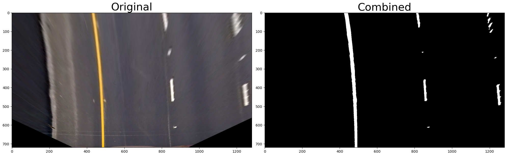

# Advanced Lane Finding

This project is the continuation of the [Finding Lane Lines](https://github.com/alexander-stadnikov/CarND-Finding-Lane-Lines). This time the goal is to identify curved lane lines. I’ll recognize lines based on the perspective transform to a bird’s eye view of an original frame from the camera.

## The Project Overview

The goals / steps of this project are the following:

* Compute the camera calibration matrix and distortion coefficients given a set of chessboard images.
* Apply a distortion correction to raw images.
* Apply a perspective transform to rectify binary image ("birds-eye view").
* Use color transforms, gradients, etc., to create a thresholded binary image.
* Detect lane pixels and fit to find the lane boundary.
* Determine the curvature of the lane and vehicle position with respect to center.
* Warp the detected lane boundaries back onto the original image.
* Output visual display of the lane boundaries and numerical estimation of lane curvature and vehicle position.

## The Project Layout

The project is organized as a Python application. The [pipeline](https://github.com/alexander-stadnikov/CarND-Advanced-Lane-Lines/tree/main/pipeline) was implemented as a Python package.
The application uses the pipeline to perform all computations and is located in the file [project.py](https://github.com/alexander-stadnikov/CarND-Advanced-Lane-Lines/blob/main/project.py).

## Camera Calibration and Image Undistortion

The Camera Calibration is needed to avoid the [Optic Distortion](https://en.wikipedia.org/wiki/Distortion_(optics)) effect. Each camera has it's own distortion coefficients. These coefficients might be computed with a known geometric pattern. This project contains pictures of the chessboard patterns with high contrast and known geometry. The pattern's size is the number of inner corners – there're nine in each row and six corners in each column.

OpenCV has a very useful function [findChessboardCorners](https://docs.opencv.org/master/d9/d0c/group__calib3d.html#ga93efa9b0aa890de240ca32b11253dd4a). The function takes a grayscaled image, the geometry as arguments, and returns coordinates of found corners:

```python
img = cv.imread("calibration.jpg")
gray = cv.cvtColor(img, cv.COLOR_BGR2GRAY)
res, corners = cv.findChessboardCorners(gray, (9, 6), None)
```

To compute the calibration coefficient and the internal camera matrix OpenCV offers [calibrateCamera](https://docs.opencv.org/master/d9/d0c/group__calib3d.html#ga3207604e4b1a1758aa66acb6ed5aa65d) function. It takes as arguments expected 3D object points, captured 2D image points, and the image's shape. To compute object points Z coordinate is assumed to be equal to zero.

For more precise calibration, it’s recommended to use as many pictures as possible. For each image, it’s necessary to find chessboard corners and store them as a collection. Object points for each picture will be the same, and also organized a collection:

```python
import cv2 as cv
import numpy as np

w, h = 9, 6
obj_coords = np.zeros((w * h, 3), np.float32)
obj_coords[:, :2] = np.mgrid[0:w, 0:h].T.reshape(-1, 2)
gray = None

for file in images:
    img = cv.imread(file)
    gray = cv.cvtColor(img, cv.COLOR_BGR2GRAY)
    res, corners = cv.findChessboardCorners(gray, pattern_size, None)

    if not res:
        print(f"Unable to find chessboard corners on {file}")
        continue

    img_points.append(corners)
    obj_points.append(obj_coords)

shape = gray.shape[::-1]
_, mtx, dist, _, _ = cv.calibrateCamera(obj_points, img_points, shape, None, None)
```

Finally, an image might be [undistorted](https://docs.opencv.org/master/d9/d0c/group__calib3d.html#ga69f2545a8b62a6b0fc2ee060dc30559d):

```python
img = cv.imread("image.jpg")
undistored_img = cv.undistort(img, mtx, dist, None, mtx)
```


### Possible improvements

The chessboard pattern has a few disadvantages. For example, it’s necessary for all corners to be visible. It also depends on many photos. In the provided pictures, it’s not possible to recognize the pattern on the next images:

* camera_cal/calibration1.jpg
* camera_cal/calibration4.jpg
* camera_cal/calibration5.jpg

There’s a better pattern named [ChArUco](https://docs.opencv.org/3.4/df/d4a/tutorial_charuco_detection.html#:~:text=Charuco%20definition,in%20terms%20of%20subpixel%20accuracy.) pattern. It’s the same chessboard, but it contains “markers” from a predefined “dictionary”. Each symbol looks like a QR-code, and the position is known. It means, even if the pattern only partially visible it’s possible to find some matched corners.

As the next improvement, it’s possible to use not pictures but video input. The video file is just a set of frames that could be processed separately.

I made a simple video with my iPhone for the demonstration. When the internal matrix and distortion coefficients, I just augmented these markers and their coordinate systems.


In a real production environment, these actions might be done by a robot.


**For the project only provided images will be used for the camera calibration.**

The full source code for the step is in the file [camera.py](https://github.com/alexander-stadnikov/CarND-Advanced-Lane-Lines/blob/main/pipeline/camera.py).

## Perspective Transform

We need to calculate the curvature of the lane. The original image contains the perspective lane projection. To make the analysis easier, let’s transform the original image into its “Bird’s-eye-view” (BEV) projection. OpenCV contains usefull funciton [getPerspectiveTransform](https://docs.opencv.org/master/da/d54/group__imgproc__transform.html#ga20f62aa3235d869c9956436c870893ae). It takes points from the original image and a set of the same points in their expected positions. The function returns the Transformation Matrix. We need two matrices: from the original to BEV and from BEV to the original.

```python
src = np.float32([
    (570, 465), (700, 465), (260, 680), (1050, 680)
])

dst = np.float32([
    (450, 0), (830,0), (450, 720), (830, 720)
])

M = cv.getPerspectiveTransform(src, dst)
Minv = cv.getPerspectiveTransform(dst, src)
```

With the given matrices, we can transform images back and forth with function [warpPerspective](https://docs.opencv.org/master/da/d54/group__imgproc__transform.html#gaf73673a7e8e18ec6963e3774e6a94b87).

```python
warped_img = cv.warpPerspective(img, M, img.shape[1::-1], flags=cv.INTER_LINEAR)

unwarped_img = cv.warpPerspective(img, Minv, img.shape[1::-1], flags=cv.INTER_LINEAR)
```


Class [PerspectiveTransform](pipeline/transform.py) performs transformations and stores direct and inversed transformation matrices.

## Image Thresholding

After many experiments, I decided not to use any Edge Detector, such as Soble Detector. If it works very well with the project video, it doesn’t work well with challenges. It was hard to find the correct parameters, especially for the harder challenge.
Instead, I was experimenting with color transformations. Eventually, I found an adequate color space named CIELAB. Combined with HLS color space, it helps to see both yellow and white lines in different situations.
First of all, let’s RGB color space into HLS and CIELAB:

```python
hls = cv.cvtColor(img, cv.COLOR_RGB2HLS)
lab = cv.cvtColor(img, cv.COLOR_RGB2Lab)
```

From the HLS space, the best result gives us L and S channels. From CIELAB, the b-channel detects yellow lines better than other channels:

```python
hls_l = hls[:,:,1]
hls_s = hls[:,:,2]
lab_b = lab[:,:,2]
```

We can select values from channels with the next code snippets:
Combining threshold is an art. I found different parameters for provided video inputs. The best result obtained with:
- Project video
  - HLS L = (200, 255)
  - HLS S = (80, 255)
  - LAB B =(190, 255)
- Challenge video
  - HLS L = (200, 255)
  - HLS S = (100, 255)
  - LAB B =(190, 255)
- Harder challenge video
  - HLS L = (200, 255)
  - HLS S = (200, 255)
  - LAB B =(190, 255)




Please, check [Detector](pipeline/detector.py), [tools](pipeline/tools.py), and [project.py](project.py) for more technical details.

## Detect Lane Lines Pixels

For the Lane Lines detection, two methods implemented:
1. Detect with sliding window
1. Detect around the polynomial

The second method is an optimization of the first method.

At first, we need to find the expected initial positions of lanes. It could be done with a histogram. Let’s take an image we got on the previous step and calculate the number of non-zero Y-coordinates for each X-coordinate over the bottom half of the image.

```python
histogram = np.sum(img[img.shape[0] // 2:, :], axis=0)
```


These two peaks are initial positions for search. With sliding windows along the Y-coordinate, we can select all points which are related to lines. Finally, we can calculate the polynomial coefficients for these points and the lane between found curves:


We can use previous coefficients and search in a window near the last polynomial for the next frame.


In some cases, it’s better to start the process from method 1. I implemented the next algorightm:

- If polynomials on last five frames
  - Too far from each other
  -	Curvatures too differ
- Restart with method 1

For better visual results and cases when it’s hard to find any line, I used history for each line. The line can extrapolate coefficients from previous frames.

All technical details are in [Line](pipeline/line.py) and [Lane](pipeline/lane.py) classes.

## Determine the curvature of the lane and vehicle position with respect to center

With found coefficients, it's possible to find the curve radius according to the formula:


The formula above gives the radius in pixels. To convert these pixels to meters, we need to use the next observations:
-	The highway is in the USA
-	According to [standards](http://onlinemanuals.txdot.gov/txdotmanuals/rdw/horizontal_alignment.htm#BGBHGEGC), the lane width must be 3.7 meters
-	The dashed line is 3 meters long
-	On the warped image, the lane width matched to 370 pixels
-	The warped image represents the area in front of the car is about 30 meters long
-	The warped image total height is 720 pixels

To calculate how many meters are in each pixel, we need to divide the real-world data into the number of pixels on the warped image:


Now we can calculate the real-world radius of each line and then take their average.

To calculate the car's offset from the lane center, we need to calculate the difference in meters between the X-coordinate of the center of the image and the average curve representing the lane center.

All technical details are in [Line](pipeline/line.py) and [Lane](pipeline/lane.py) classes.

## Unwarp the result and add information

The previously described class [PerspectiveTransform](pipeline/transform.py) unwarps the image.

Now, it's possible to add overlayed information.


## Video processing

The video processing is trivial:

```python

detector = Detector(...)
v_in = VideoFileClip(f"./video_in.mp4")
v_out = v_in.fl_image(detector.pipeline)
v_out.write_videofile(f"./video_out.mp4", audio=False)
```

Details are in [project.py](project.py).

## Results

Project Video:

[](https://www.youtube.com/watch?v=aTXOZV81VPY)

Challenge Video:

[](https://www.youtube.com/watch?v=SqdOP5xWv_4)

Harder Challenge Video:

[](https://www.youtube.com/watch?v=3OPqP5DQg6Y)

## Improvements

Computer Vision is an essential and necessary part of any autonomous system. Nevertheless, it’s not a silver bullet. The approach provides a clean solution but heavily relies on parameters. The most promising solution is a traditional computer vision with modern techniques, such as Machine Learning. Machine Learning helps to tweak parameters but sometimes works as a black box. Together these techniques provide better results.
